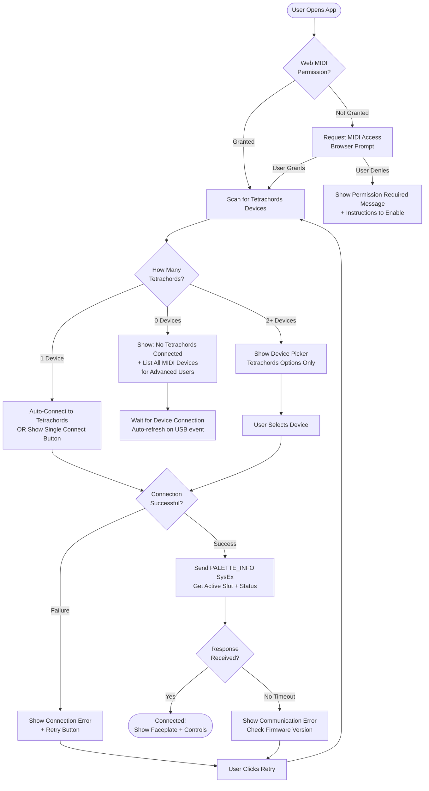
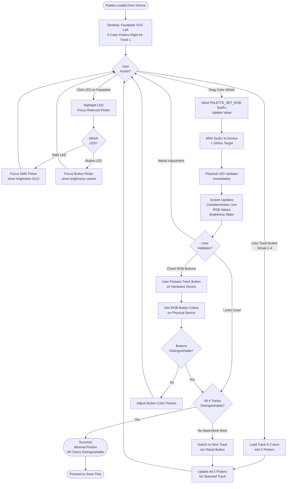
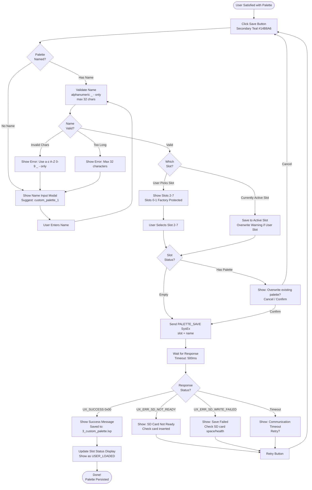

# UX Design Specification tc_lx_midi_config

**Author:** Nick
**Date:** 2026-01-01

---

<!-- UX design content will be appended sequentially through collaborative workflow steps -->

## Executive Summary

### Project Vision

tc_lx_midi_config is a browser-based Web MIDI palette editor that transforms LED color customization from a weeks-long manufacturer bottleneck into a self-service workflow. The tool solves a critical accessibility problem: colorblind users of Tetrachords devices cannot distinguish between tracks using default LED colors, forcing them to memorize positions instead of relying on visual feedback. By enabling real-time customization of all 24 LED color values with immediate hardware preview via MIDI SysEx, users can iterate on palettes that actually work for their specific color vision deficiency.

What makes this special is the combination of accessibility-first design, real-time hardware feedback (not just web simulation), zero manufacturer dependency, and community-driven palette sharing - all delivered through a browser with no installation required.

### Target Users

**Primary Users: Colorblind Tetrachords Owners**
- Approximately 10% of 250+ user base
- Have deuteranopia, protanopia, tritanopia, or other color vision deficiencies
- Struggle to distinguish tracks using default palettes
- Comfortable with music hardware but varying web/tech comfort levels
- Seeking one-time or occasional solution
- **Critical requirement**: Must have physical device present during palette design due to LED variations, PCB material effects, and individual color perception

**Secondary Users: Aesthetic Customizers**
- Non-colorblind owners seeking personalization
- Motivated by preference rather than necessity
- May experiment with multiple palettes

### Key Design Challenges

1. **LED Context Mapping Complexity**: 24 color values across 4 different field types (track_smd, track_smd_dim, track_smd_medium, track_btn[4][3]) with varying brightness levels - users need to understand which screen control maps to which physical LED without getting overwhelmed

2. **Dual Feedback Systems**: Balancing the approximate faceplate visualization (serves as guide/map) with real-time hardware preview (serves as ground truth) - both are essential but serve different purposes. Screen display cannot match physical reality due to LED variations, PCB material light diffusion, and individual color perception.

3. **Technical Barrier vs Visual Simplicity**: Web MIDI + MIDI SysEx is inherently technical, but interface needs to be welcoming for users with varying tech comfort levels - visual-first approach must bridge this gap

4. **Colorblind Design Paradox**: Designing color controls for users who can't perceive standard color relationships - the physical hardware becomes the essential feedback mechanism, not the screen

5. **Mode-Switching Specification**: Device-specific LED behavior patterns require separate detailed specification due to idiosyncratic mode logic

### Design Opportunities

1. **Faceplate as Visual Map**: Mode switching to highlight different LED contexts on the device faceplate SVG creates an intuitive learning tool - "show me which LEDs I'm editing" becomes immediately clear. This should be the default landing experience.

2. **Hardware-First Validation**: Embracing the fact that screen ≠ reality means we can focus the faceplate on clarity and mapping rather than color accuracy - it's a guide for understanding LED positions and contexts, not a color simulator

3. **Progressive Disclosure**: Start with visual faceplate + simple controls, reveal complexity only as needed - users don't need to understand field IDs, brightness indices, or MIDI SysEx to get started

4. **Community Learning**: Well-designed LED mapping helps users understand palette structure, making it easier to share and discuss palettes in the community (e.g., "I made track 3's medium brightness more cyan")

5. **Experimental Faceplate Feature**: Faceplate SVG visualization is worth a 1-day exploratory prototype to evaluate implementation effort vs UX value - it would undoubtedly improve user experience but requires validation of technical investment

## Core User Experience

### Defining Experience

The core user experience is the **complete configuration workflow**: sync from device → iterative color tweaking → save to device. This is not a tool with one hero feature and supporting functions - every step in the workflow is essential. If any part fails, the tool is useless.

While **color adjustment** is the most frequent action (users will sync once, save once, and adjust colors numerous times in a single session), frequency doesn't determine importance. The entire loop must work seamlessly:

1. **Sync from device** provides the starting point and validates the connection
2. **Iterative color tweaking** enables experimentation to arrive at desired configuration (users don't know RGB numbers in advance)
3. **Save to device** is the act of configuration - making customization permanent

The interaction model centers on the **LED selection + color adjustment + immediate hardware feedback loop**. The mapping between "I moved this color slider" → "that specific LED on my device changed" must be crystal clear, with zero perceived latency.

### Platform Strategy

**Primary Platform: Desktop Web Application**
- **Browser**: Chromium-based browsers only (Chrome, Edge, Opera, Brave) - Web MIDI API requirement
- **Architecture**: React + Vite SPA with Tailwind CSS
- **Interaction**: Mouse/keyboard primary (color wheel, RGB value inputs, clicking SVG elements)
- **Device**: Desktop/laptop optimized
- **Connectivity**: Requires active MIDI connection (no offline functionality needed)

**Responsive Strategy:**
- **Large screens (primary)**: All controls visible simultaneously
  - Faceplate SVG + all color pickers for current track displayed at once
  - For one track: 2 color pickers (RGB buttons: very bright + standard) + 3 color pickers (SMD LEDs: bright, dim, complementary)
  - Virtual track buttons enable switching between 4 tracks

- **Smaller screens (secondary)**: Contextual display
  - Click LED on faceplate → relevant color pickers appear
  - Click RGB button → 2 pickers visible
  - Click SMD LED → 3 pickers visible

**Mobile/Tablet Considerations:**
- Not supported in first iteration (Web MIDI unavailable on iOS)
- Android tablet/phone support deferred to future iteration
- Focus on laptops and desktops first

### Effortless Interactions

**What Should Feel Completely Natural:**

1. **Track Switching**: Users click virtual track buttons on the faceplate SVG, mirroring physical hardware behavior. Existing mental models from device experience apply directly.

2. **LED Selection**: Click any LED on the faceplate to focus editing controls for that element. On larger screens, all controls visible; on smaller screens, contextual controls appear.

3. **Color Manipulation**: Spectrum-style color wheel enables intuitive exploration without understanding RGB numbers
   - Drag around color wheel to explore hues
   - Brightness slider to adjust intensity
   - Complementary color displayed continuously (180° opposite on wheel, shown with connecting line)
   - RGB values available for precision input when needed

4. **Real-time Hardware Feedback**: Zero "apply" delay - as soon as user touches color wheel, the physical device LED changes (<100ms target latency)

5. **Color Propagation**: Copy/paste between LEDs to quickly propagate color schemes across multiple contexts

6. **Hardware Connection**: Device detection and connection status clearly visible - no guessing whether Web MIDI is working

**Friction Elimination:**
- No "apply" button - changes are instant on hardware
- No confusion about "which track am I editing?" - virtual track buttons make context obvious
- No need to memorize field IDs or brightness indices - faceplate visualization provides intuitive mapping
- No switching between "edit mode" and "preview mode" - editing IS previewing on real hardware

### Critical Success Moments

**Make-or-Break Interactions:**

1. **First Connection** (30 seconds)
   - "I clicked connect and my Tetrachords device appeared"
   - If this fails, user never gets started
   - Must handle browser MIDI permissions gracefully

2. **First Sync from Device** (5 seconds)
   - "I loaded my current palette and recognized the colors I'm seeing on my hardware"
   - Validates connection is working correctly
   - Builds trust in the sync mechanism

3. **First Color Change** (immediate)
   - "I moved the color wheel and that specific LED on my device changed instantly"
   - The magic moment where users understand the tool
   - Must feel real-time, not delayed or laggy

4. **Finding Distinguishable Colors** (for colorblind users)
   - "I adjusted these colors and now I can actually tell the difference between tracks"
   - The core accessibility problem solved
   - Physical hardware provides ground truth for color perception

5. **Saving Successfully** (5 seconds)
   - "I clicked save and my custom palette is now permanent on my device"
   - Configuration complete, work preserved
   - Must provide clear confirmation of success

**Failure Scenarios to Prevent:**
- LED mapping confusion → user doesn't know what they're editing → abandonment
- High latency → feels broken, not real-time → frustration and distrust
- Save failure → all work lost → user abandons tool permanently
- Connection instability → repeated disconnects → unreliable experience

### Experience Principles

These principles guide all UX design decisions for tc_lx_midi_config:

1. **Complete Workflow Integrity**: Every step (sync → adjust → save) is essential. Frequency doesn't determine importance - the entire configuration loop must work flawlessly or the tool is useless.

2. **Hardware as Ground Truth**: The screen is a guide and map, not a simulator. Physical device LEDs provide the authoritative feedback, especially for colorblind users where screen colors are meaningless.

3. **Zero-Latency Feel**: Real-time hardware updates must feel instant (<100ms). No "apply" buttons - changes propagate to device LEDs as the user interacts with controls.

4. **Progressive Visual Clarity**: Start with the faceplate SVG as the visual map. Users understand "what am I editing?" through the device representation, then use mode switching to highlight specific LED contexts when needed.

5. **Intuitive Color Exploration**: Users don't need to understand RGB numbers to create palettes. Color wheel interaction enables exploration, with RGB values available for precision. Complementary colors displayed continuously, not as a one-shot action.

6. **Desktop-Optimized, Mobile-Considered**: Optimize for desktop/laptop (Chromium browsers with Web MIDI). Larger screens show all controls simultaneously; smaller screens use contextual display (click LED → relevant controls appear).

7. **Mirror Hardware Behavior**: Virtual track buttons match physical device interaction. Users apply existing mental models from their hardware experience.

## Desired Emotional Response

### Primary Emotional Goals

**Quiet satisfaction and competence.** "This just works. I can do this myself. Problem solved."

tc_lx_midi_config is a utility tool, not an experience product. The emotional goal is grounded satisfaction and reliability, not flashy delight or overhyped excitement. Users should feel capable and in control without the tool drawing attention to itself.

**Emotional tone:** Low-key, capable, reliable. The tool gets out of the way and lets users accomplish their configuration goals efficiently.

### Emotional Journey Mapping

**Discovery:**
- Colorblind users: Relief and hope ("Finally, there's a solution for this")
- Aesthetic users: Mild interest ("Oh, I can customize this?")

**During Use:**
- Focused and engaged during iterative color tweaking
- Quietly satisfied that the tool works as expected
- Slightly playful/creative (especially for aesthetic customizers)
- Real-time LED feedback creates engagement without friction

**After Completion:**
- Colorblind users: "This actually works for my vision. Done." (relief, accomplishment)
- Aesthetic users: "That looks good. Cool." (satisfaction)
- Low-key accomplishment, not euphoric celebration

**Error Recovery:**
- Clear error messages → "I understand what went wrong" (informed, not confused)
- Easy recovery paths → "I can fix this" (capable, not helpless)

**Returning Users:**
- Familiar and confident (for occasional palette adjustments)
- Most users are one-time or infrequent users - tool should be immediately re-learnable

### Micro-Emotions

The tool should consistently deliver the first emotional state in each pair:

- **Confidence** over confusion (clear LED mapping, obvious connection status)
- **Trust** over skepticism (real-time feedback validates changes, save confirmation builds trust)
- **Accomplishment** over frustration (successful palette creation and save)
- **Calm** over anxiety (predictable behavior, no fear of breaking something)
- **Capability** over helplessness ("I can do this myself" vs. "I need manufacturer help")
- **Satisfaction** over disappointment (tool solves the problem it promises to solve)

These emotional states are table stakes for well-designed utility software, not unique differentiators. Validation happens through actual use, not theoretical design.

### Design Implications

**Building Confidence:**
- Crystal-clear LED mapping via faceplate visualization
- Obvious connection status (connected/disconnected)
- No ambiguity about which LED is being edited

**Building Trust:**
- First color change moment validates the connection works
- Real-time hardware feedback proves changes are actually happening
- Clear save confirmation shows palette was successfully stored

**Creating Engagement:**
- Immediate hardware LED response maintains focus
- Color wheel exploration feels natural and intuitive
- Complementary color display encourages experimentation

**Preventing Negative Emotions:**
- Clear error messages explain what went wrong
- Easy recovery paths prevent helplessness
- Predictable behavior prevents anxiety about breaking something
- Auto-save or unsaved changes warning prevents work loss

### Emotional Design Principles

1. **Utility Over Spectacle**: The tool should feel capable and reliable, not flashy or overhyped. Get out of the way and let users accomplish their goals.

2. **Quiet Competence**: Success feels like "this works as expected," not "wow, amazing!" Low-key satisfaction is the target emotional state.

3. **Earned Trust Through Transparency**: Users trust the tool because they can see it working (real-time LED feedback, clear status indicators, explicit confirmations).

4. **Empowerment Through Self-Service**: The core emotional shift is from "I need manufacturer help" to "I can do this myself." Every interaction should reinforce capability and control.

## UX Pattern Analysis & Inspiration

### Inspiring Products Analysis

**1. Expert Sleepers ES-9 Config Tool**
- **URL**: https://expert-sleepers.co.uk/webapps/es9_config_tool_1.2.html
- **Product Type**: Eurorack module web-based configuration tool
- **Strengths**:
  - **Information Density**: All controls visible simultaneously - no modal dialogs, no navigation layers
  - **Efficiency for Power Users**: Expert users can scan entire configuration state at a glance
  - **Direct Manipulation**: Every parameter immediately accessible without menu diving
- **Weaknesses**:
  - **Visual Overwhelm**: Poor visual hierarchy and design make dense interface intimidating
  - **Lacks Visual Structure**: No clear grouping or progressive disclosure for beginners
  - **Aesthetic Barrier**: Utilitarian appearance may discourage less technical users

**2. Cycle Instruments Tetrachords Config Tool**
- **URL**: https://cycleinstruments.com/tetrachords-config/
- **Product Type**: Tetrachords hardware configuration web app (sibling product)
- **Strengths**:
  - **Visual Polish**: Clean, professional interface aligned with Cycle Instruments brand
  - **Approachable Design**: Visual hierarchy guides users through configuration workflow
  - **Brand Consistency**: Matches style guide and faceplate aesthetic
- **Weaknesses**:
  - **Navigation Friction**: Modal-based approach requires excessive clicking to access different parameters
  - **Hidden State**: Configuration state distributed across multiple screens/modals
  - **Inefficient for Iteration**: Power users must repeatedly navigate through UI layers to compare/adjust settings

**3. Spectrum Color Picker**
- **Product Type**: macOS color picker application
- **Strengths**:
  - **Complementary Color Visualization**: Line through color wheel center continuously shows both selected color (solid segment) and complementary color (dashed segment) at 180° relationship
  - **Intuitive Color Exploration**: Drag anywhere on color wheel to explore hues, brightness slider shows current color at varying intensities
  - **Visual Learning Tool**: Geometric line representation teaches color theory (complementary relationships) without explanation
  - **Clean Interface Hierarchy**: Color wheel as hero element, supporting controls (brightness slider, RGB inputs, color history swatches) clearly subordinate
  - **Continuous Feedback**: Complementary color updates in real-time as user drags - no button click needed to "show complementary"
- **Weaknesses**:
  - Not web-based (native macOS app), but pattern fully transferable to web canvas/SVG
- **Transferable Patterns**:
  - Line-through-center visualization for showing color relationships geometrically
  - Continuous complementary color display (not toggle-based)
  - Brightness slider as vertical bar showing color gradient from dark to light
  - Color history swatches for quick palette building

### Transferable UX Patterns

**Hybrid Density + Polish Approach:**
- Marry Expert Sleepers' information density with Cycle Instruments' visual polish
- Target: All controls for current track visible simultaneously (5 color pickers: 2 for RGB buttons + 3 for SMD LEDs) without visual overwhelm
- Strategy: Use visual grouping, clear labels, and whitespace to make dense interface approachable

**Spectrum-Inspired Color Wheel:**
- Implement line-through-center complementary color visualization
- Continuous complementary color updates (no "show complementary" button)
- Brightness slider showing current hue at varying intensities
- RGB value inputs for precision alongside visual wheel exploration

**Faceplate as Information Architecture:**
- Faceplate SVG serves dual purpose: visual map + navigation structure
- Click LED on faceplate → highlight that LED + show its color picker(s)
- Virtual track buttons on faceplate → switch between 4 tracks
- Eliminates modal navigation friction while maintaining visual clarity

**Responsive Information Density:**
- **Large screens**: Expert Sleepers density approach - all 5 color pickers for current track visible
- **Smaller screens**: Contextual display - click LED → show relevant pickers only
- Adapts information density to available screen real estate without separate mobile/desktop designs

**Color History + Copy/Paste:**
- Spectrum-style color swatches showing recently used/edited colors
- One-click copy from history to apply to different LEDs
- Enables rapid palette iteration and consistency across LED contexts

### Anti-Patterns to Avoid

**From Expert Sleepers:**
- ❌ Visual overwhelm through poor hierarchy
- ❌ No progressive disclosure for beginners
- ❌ Utilitarian appearance creating accessibility barrier for less technical users

**From Cycle Instruments Config:**
- ❌ Modal-based navigation hiding configuration state
- ❌ Excessive clicking to access different parameters
- ❌ Power user friction from repeated navigation cycles

**From General Hardware Config Tools:**
- ❌ "Apply" buttons creating latency between adjustment and hardware feedback
- ❌ Separate "preview mode" disconnected from editing mode
- ❌ Technical terminology (field IDs, brightness indices) exposed without visual mapping

### Design Inspiration Strategy

**Core Approach: Visible Complexity with Visual Structure**

The palette editor needs to balance competing demands:
- **Power user efficiency** (Expert Sleepers density)
- **Visual approachability** (Cycle Instruments polish)
- **Intuitive color exploration** (Spectrum interaction model)

**Implementation Guidelines:**

1. **Information Hierarchy**:
   - Hero element: Faceplate SVG (visual map + navigation)
   - Primary controls: Color wheel + brightness slider for selected LED
   - Secondary controls: RGB value inputs, complementary color display
   - Tertiary: Color history swatches, copy/paste actions

2. **Progressive Disclosure**:
   - Default: Show faceplate + track 1 color pickers (all 5 visible on large screens)
   - Interaction: Click any LED → that LED highlights, its pickers come into focus
   - Advanced: Mode switching to highlight LED contexts on faceplate (educational)

3. **Visual Language**:
   - Follow Cycle Instruments style guide for consistency
   - Use Spectrum's geometric color relationship visualization
   - Employ whitespace and grouping to make density scannable

4. **Real-time Feedback Loop**:
   - No "apply" buttons - Spectrum's continuous update model
   - Screen updates + hardware LED updates happen simultaneously (<100ms)
   - Complementary color line updates as user drags color wheel

## Design System Foundation

### Design System Choice

**Tailwind CSS + Cycle Instruments Style Guide**

tc_lx_midi_config uses Tailwind CSS as its design system foundation, following established conventions from the Cycle Instruments style guide. This themeable system approach provides the flexibility needed for custom color manipulation interfaces while maintaining brand consistency with sibling products.

### Rationale for Selection

**Existing Infrastructure:**
- Tailwind CSS already specified in project architecture (React + Vite + Tailwind)
- Cycle Instruments style guide (docs/STYLE_GUIDE.md) defines brand-specific Tailwind conventions
- Sibling product (Tetrachords config tool) uses matching visual language

**Project Fit:**
- **Rapid Development**: Utility-first approach enables fast iteration on palette editor UI
- **Full Customization**: No constraints on implementing Spectrum-inspired color wheel and unique LED mapping visualizations
- **Accessibility Built-in**: Style guide enforces WCAG 2.1 Level AA standards
- **Brand Consistency**: Matches Cycle Instruments visual identity and user expectations

**Technical Advantages:**
- Small bundle size (unused utilities purged at build time)
- Responsive design patterns already established in style guide
- No learning curve - team already familiar with Tailwind conventions

### Implementation Approach

**Standard Components (Use Style Guide Patterns):**
- Buttons (primary, secondary, danger states for Connect/Sync/Save actions)
- Text inputs (RGB value entry fields)
- Modal dialogs (error messages, save confirmations)
- Connection status indicators

**Custom Components (Build with Tailwind + Native Web APIs):**
1. **Color Wheel Component**:
   - Canvas or SVG-based circular color picker
   - Spectrum-inspired line-through-center for complementary color visualization
   - Tailwind utilities for container, layout, and state styling
   - Native drag interaction for hue selection

2. **Interactive Faceplate SVG**:
   - Clickable LED elements with hover/active states
   - Tailwind classes for highlighting selected track/LED
   - Mode-switching to highlight different LED contexts
   - Responsive scaling for different screen sizes

3. **Brightness Slider**:
   - Vertical slider showing current hue at varying intensities
   - Gradient background updated in real-time as color wheel changes
   - Tailwind utilities for track and thumb styling

**Layout Strategy:**
- Mobile-first responsive approach (per style guide)
- Grid or flexbox layouts using Tailwind utilities
- Breakpoints: sm (640px), md (768px), lg (1024px), xl (1280px)
- Large screens: All 5 color pickers for current track visible simultaneously
- Smaller screens: Contextual display (click LED → show relevant pickers)

### Customization Strategy

**Tailwind Configuration:**
- Extend default theme with Cycle Instruments brand colors
- Custom spacing scale if needed for LED/button layouts
- Custom z-index layers for faceplate + controls layering
- Purge configuration to include custom component class patterns

**Component Library Decisions:**
- **Color Wheel**: Custom implementation (no standard library matches Spectrum pattern)
- **Sliders**: Evaluate headlessui/react or build custom with Tailwind
- **Modals**: Use Tailwind UI modal patterns from style guide
- **Tooltips**: Tailwind CSS tooltip patterns for LED context hints

**Accessibility Customization:**
- Focus visible states for all interactive elements (keyboard navigation)
- ARIA labels for color wheel and slider controls
- Sufficient color contrast for all text (WCAG 2.1 Level AA)
- Clear error states with text descriptions (not color-only indicators)

**Design Tokens:**
- LED RGB values are configuration data, not theme tokens
- Brand colors (backgrounds, text, borders) use style guide tokens
- Spacing and typography follow style guide scale
- No custom color palette beyond brand colors - user-generated LED colors are dynamic

## Defining Core Experience

### The Defining Interaction

**"Drag the color wheel and watch my device LED change instantly"**

This is the magic moment that makes tc_lx_midi_config work. Users don't describe this tool as "palette management software" - they describe it as "I can just turn the color and see it change on my hardware." The defining experience is direct manipulation of physical LEDs through visual controls, with zero perceived latency.

If we nail this real-time hardware feedback loop, everything else follows. If this feels laggy or broken, the tool is useless regardless of how polished the rest of the UI is.

**What makes this experience unique:**
- Not just screen preview - actual hardware LEDs change in real-time
- Not configuration-then-apply workflow - continuous live feedback
- Not technical MIDI tool - visual-first color exploration with hardware validation

### User Mental Model

**Existing Knowledge:**
Users already understand their Tetrachords hardware intimately:
- 4 track buttons they press during performance
- SMD LEDs that provide visual feedback for different states
- Physical LED behavior across different brightness levels and contexts
- Track-switching interaction model from hardware use

**Expected Behavior:**
Users expect the tool to mirror their hardware mental model:
- Virtual track buttons work like physical track buttons (click to switch tracks)
- Click an LED on the faceplate → controls for that LED appear
- Color wheel interaction feels like turning a knob (continuous, not discrete)
- Changes happen immediately on hardware (like adjusting a hardware parameter)
- Save action is explicit and confirmed (don't accidentally lose custom palette)

**Potential Confusion Points:**
1. **LED Mapping Complexity**: 24 colors across different contexts (SMD bright/dim/medium, RGB button bright/standard) can overwhelm
   - **Solution**: Faceplate visualization as map, mode-switching to highlight contexts

2. **Screen vs Reality**: Colors on screen don't match physical LEDs exactly
   - **Solution**: Embrace hardware as ground truth, position screen as guide/map not simulator

3. **Technical Barrier**: Web MIDI + SysEx feels technical to non-experts
   - **Solution**: Hide technical complexity behind visual-first interface

**Current Solutions (How Users Solve This Today):**
- Contact manufacturer and wait weeks for custom palette firmware
- Memorize track positions instead of relying on LED color differentiation
- Live with default palettes that don't work for their color vision

**What Users Love/Hate:**
- **Hate**: Manufacturer dependency, weeks-long turnaround, inability to iterate
- **Love**: The promise of self-service, immediate results, ability to experiment
- **Need**: Hardware validation (screen colors meaningless for colorblind users)

### Success Criteria for Core Experience

**"This Just Works" Indicators:**

1. **Immediate Feedback** (<100ms latency):
   - User drags color wheel → device LED changes instantly
   - Feels like direct hardware manipulation, not software with lag
   - No "apply" button needed - changes propagate continuously

2. **Crystal-Clear LED Mapping**:
   - User always knows which LED they're editing
   - Faceplate visualization shows exactly which physical LED corresponds to controls
   - No confusion about track context or brightness level

3. **Successful Color Discovery**:
   - Colorblind users find distinguishable colors through hardware experimentation
   - Complementary color line helps users understand color relationships geometrically
   - RGB value inputs available for precision when visual exploration insufficient

4. **Reliable Save/Sync**:
   - Palette saves to device successfully with clear confirmation
   - Sync from device loads current palette accurately
   - No fear of losing work or breaking device

5. **Effortless Track Switching**:
   - Virtual track buttons mirror physical hardware behavior
   - Switching tracks feels instant and natural
   - All controls for current track immediately visible (large screens)

**User Feels Accomplished When:**
- "I adjusted these colors and now I can actually tell tracks apart on my hardware"
- "That LED changed the moment I moved the wheel - this is real-time"
- "I understand which LEDs I'm editing by looking at the faceplate"
- "I saved my palette and it's now permanent on my device"

### Novel vs. Established UX Patterns

**Established Patterns (Don't Reinvent):**
- **Color Wheel**: Circular hue selector - universally understood pattern
- **Brightness Slider**: Vertical or horizontal slider - familiar input pattern
- **RGB Value Inputs**: Numeric entry for precision - standard color tool pattern
- **Copy/Paste**: Transfer values between contexts - established productivity pattern

**Novel Patterns (Require User Education):**

1. **Complementary Color Line Visualization** (from Spectrum):
   - Line through color wheel center shows selected color (solid) and complementary (dashed)
   - Teaches color theory visually without explanation
   - Continuous display (not toggle-based) - novel but intuitive
   - **Education approach**: Visual affordance is self-explanatory, no tutorial needed

2. **Interactive Faceplate as Navigation**:
   - Faceplate SVG serves dual purpose: visual map + navigation structure
   - Click LED → highlight + show controls for that element
   - Mode-switching to highlight LED contexts (educational tool)
   - **Education approach**: Mirrors hardware familiarity, progressive disclosure reduces overwhelm

3. **Real-time Hardware Preview** (not just screen simulation):
   - Changes propagate to physical device LEDs instantly during editing
   - Hardware provides ground truth validation, screen provides guide
   - **Education approach**: First color change moment teaches the interaction

**Innovation Within Familiar Patterns:**
- Expert Sleepers density + Cycle Instruments polish = approachable information density
- Color wheel + complementary line = enhanced visual learning
- Faceplate map + contextual controls = modal-free navigation

### Experience Mechanics

**Core Interaction Flow: Adjusting an LED Color**

**1. Initiation:**
- **Trigger**: User wants to change a specific LED color (e.g., "Track 2's bright SMD LED")
- **Entry point**: Click the LED on the faceplate SVG OR use virtual track buttons to switch to track 2
- **System response**:
  - Clicked LED highlights on faceplate
  - Relevant color picker(s) appear (or come into focus if already visible)
  - Current color loads into color wheel + brightness slider

**2. Interaction:**
- **Primary action**: Drag around color wheel to explore hues
  - Color wheel shows full spectrum in circular layout
  - Complementary color line updates continuously (solid + dashed segments)
  - Brightness slider shows current hue at varying intensities
- **Secondary action**: Adjust brightness slider to change intensity
  - Slider gradient updates to show selected hue from dark to light
- **Tertiary action**: Enter RGB values directly for precision
  - Numeric inputs for R, G, B (0-255 or 0-4095 depending on display)

**System Response (Real-time):**
- **Screen updates**: Color wheel selector, complementary line, brightness indicator, RGB values, faceplate LED color all update
- **Hardware updates**: Physical device LED changes to match (<100ms target latency)
- **No "apply" delay**: Changes propagate instantly as user drags

**3. Feedback:**
- **Visual feedback**:
  - Screen controls update in real-time showing current selection
  - Faceplate SVG LED color approximates the selection (guide, not simulator)
- **Hardware feedback**:
  - Physical device LED changes immediately - ground truth validation
  - User sees actual LED color accounting for PCB material, LED variation, individual color perception
- **Success indicators**:
  - LED changed to expected color → user feels successful
  - Colorblind user can distinguish this LED from others → core problem solved
- **Error handling**:
  - If MIDI connection lost → clear status indicator, prompt to reconnect
  - If color out of range → clamp to valid values, show warning

**4. Completion:**
- **How user knows they're done**:
  - Hardware LED shows the desired color
  - For colorblind users: This LED is now distinguishable from other tracks
- **Successful outcome**:
  - LED color adjusted to preference/accessibility need
  - Change visible on hardware device immediately
- **What's next**:
  - Continue to other LEDs (5 per track × 4 tracks = 20 adjustment opportunities)
  - OR save palette to device permanently (explicit save action)
  - OR sync from device to reload original palette (undo all changes)

**Supporting Mechanics:**

**Copy/Paste Between LEDs:**
- Select LED → copy color → select different LED → paste
- Enables rapid palette consistency across tracks or contexts
- Familiar productivity pattern, no learning curve

**Color History:**
- Recently used/edited colors appear as swatches (Spectrum pattern)
- One-click to apply previous color to current LED
- Speeds iteration and experimentation

**Mode Switching (Educational Feature):**
- Toggle modes to highlight different LED contexts on faceplate
- "Show all track_smd" → highlights 4 bright SMD LEDs across tracks
- "Show all track_smd_dim" → highlights 4 dim SMD LEDs
- Helps users understand LED structure without technical field IDs

## Visual Design Foundation

### Color System

**Color Strategy: Brand-Aligned Variation for Color Accuracy**

tc_lx_midi_config uses Cycle Instruments' established color palette with strategic variations optimized for color perception and manipulation tasks.

**Brand Colors (from Style Guide):**
- **Primary Blue**: `#0EA5E9` - connection status, active states, primary CTAs
- **Secondary Teal**: `#14B8A6` - success confirmations, positive feedback
- **Dark**: `#1a1a1a` - standard brand dark

**Palette Editor Variations:**
- **App Background (Neutral Gray)**: `#2e2e2e` - optimized for color perception
  - CSS Variable: `--app-bg-neutral` (single point of adjustment)
  - Tailwind Extension: `bg-app-neutral`
  - Rationale: Neutral gray reduces color temperature bias while maintaining brand's dark aesthetic

- **Workspace Background (Warm White)**: `#fafaf8` - slightly warm neutral
  - CSS Variable: `--workspace-bg`
  - Tailwind Extension: `bg-workspace`
  - Rationale: Reduces eye strain during extended color editing while maintaining color accuracy
  - Use for: Faceplate SVG surface, color picker backgrounds, RGB value input areas

**Semantic Color Mapping:**

| Purpose | Color | Hex | Usage |
|---------|-------|-----|-------|
| Primary Action | Primary Blue | #0EA5E9 | Connect, Sync From Device buttons |
| Secondary Action | Secondary Teal | #14B8A6 | Sync To Device, Save buttons |
| Success | Green | #22c55e | Successful connection, save confirmations |
| Warning | Yellow | #eab308 | MIDI permission prompts, non-critical errors |
| Error | Red | #ef4444 | Connection failures, sync errors |
| App Background | Neutral Gray | #2e2e2e | Main application surface |
| Workspace | Warm White | #fafaf8 | Color editing surface (faceplate + pickers) |
| Text on Dark | White/Light Gray | #ffffff / #e5e5e5 | Text on app background |
| Text on Light | Dark Gray | #1f1f1f | Text on workspace background |
| Borders on Dark | Medium Gray | #525252 | Dividers, control borders on dark surfaces |
| Borders on Light | Light Gray | #d4d4d4 | Dividers, control borders on light surfaces |

**Accessibility Compliance:**
- All text meets WCAG 2.1 Level AA contrast ratios (4.5:1 minimum)
- Primary Blue on neutral gray: 6.2:1 contrast ratio ✓
- Dark text on warm white: 16.5:1 contrast ratio ✓
- Interactive elements have sufficient contrast in all states (default, hover, active, focus)

**Implementation Notes:**
- Define CSS custom properties for brand-aligned variations:
  ```css
  :root {
    --app-bg-neutral: #2e2e2e;
    --workspace-bg: #fafaf8;
    --primary-blue: #0EA5E9;
    --secondary-teal: #14B8A6;
  }
  ```
- Extend Tailwind config with custom colors:
  ```js
  theme: {
    extend: {
      colors: {
        'app-neutral': 'var(--app-bg-neutral)',
        'workspace': 'var(--workspace-bg)',
      }
    }
  }
  ```
- Single variable adjustment enables rapid iteration on background neutrality

### Typography System

**Typography Strategy: Brand Sans-Serif with Tighter Information Density**

tc_lx_midi_config uses Cycle Instruments' standard sans-serif typography with a tighter type scale optimized for dense color editing interfaces (Expert Sleepers influence).

**Typeface:**
- **Primary**: System sans-serif stack (brand standard)
- **Rationale**: Maintains visual consistency with Cycle Instruments ecosystem
- **Fallback Stack**: `-apple-system, BlinkMacSystemFont, 'Segoe UI', Roboto, sans-serif`

**Type Scale (Tighter for Information Density):**

| Level | Size | Line Height | Weight | Use Case |
|-------|------|-------------|--------|----------|
| h1 | 1.5rem (24px) | 1.3 | 600 | Page title |
| h2 | 1.25rem (20px) | 1.4 | 600 | Section headers |
| h3 | 1.125rem (18px) | 1.4 | 600 | Subsection headers |
| body | 0.875rem (14px) | 1.5 | 400 | Default text, labels |
| small | 0.75rem (12px) | 1.4 | 400 | Helper text, secondary info |
| tiny | 0.625rem (10px) | 1.3 | 400 | Tertiary labels, metadata |

**RGB Value Display:**
- **Font**: Brand sans-serif (visual consistency over monospace)
- **Size**: `0.875rem (14px)` - body scale
- **Weight**: 500 - slightly emphasized for readability
- **Color**: Dark gray (#1f1f1f) on workspace background

**Custom Typography Classes (from Style Guide):**
- `lg-normal`: Standard letter-spacing
- `lg-medium`: Medium letter-spacing
- `lg-600`: Weight 600 for headers
- `lg-700`: Weight 700 for emphasis

**Responsive Typography:**
- **Mobile**: Base scale as defined above (optimized for smaller screens)
- **Desktop (lg: 1024px+)**: Same scale - tighter density benefits large screens

**Accessibility:**
- Minimum font size: 10px (tiny scale) - used sparingly for tertiary labels
- Primary content uses 14px body scale (comfortable reading)
- Color contrast meets WCAG 2.1 Level AA across all text sizes
- Focus states use visible outline (not color-only indicators)

### Spacing & Layout Foundation

**Spacing Strategy: Contextual Density - Dense Desktop, Generous Mobile**

tc_lx_midi_config uses adaptive spacing that maximizes information density on large screens while maintaining comfort and accessibility on mobile devices.

**Base Spacing Unit: 4px**
- Follows design system convention (divisible by 2, 4, 8 for flexibility)
- Tailwind default spacing scale applies (0.25rem = 4px)

**Spacing Scale:**

| Token | Pixels | Rem | Usage |
|-------|--------|-----|-------|
| xs | 4px | 0.25rem | Tight spacing (icon-to-label, input padding) |
| sm | 8px | 0.5rem | Compact spacing (between related controls) |
| md | 12px | 0.75rem | Standard spacing (section padding, control groups) |
| lg | 16px | 1rem | Generous spacing (between unrelated sections) |
| xl | 24px | 1.5rem | Large spacing (major section dividers) |
| 2xl | 32px | 2rem | Extra large (page-level spacing) |

**Layout Principles:**

1. **Contextual Density**: Adapt spacing based on available screen real estate
   - **Desktop (lg: 1024px+)**: All 5 color pickers for current track visible simultaneously
   - **Mobile (<1024px)**: Click LED → contextual controls appear with generous spacing

2. **Visual Grouping**: Related controls use tighter spacing
   - Color picker + brightness slider: `sm` spacing (8px)
   - RGB value inputs grouped: `xs` spacing (4px between inputs)
   - Unrelated sections: `lg` or `xl` spacing (16-24px)

3. **Breathing Room**: Workspace surface uses more generous padding
   - Faceplate SVG: `md` padding (12px) on mobile, `lg` (16px) on desktop
   - Color picker containers: `md` internal padding (12px)

**Grid System:**

**Desktop Layout (lg: 1024px+):**
```
┌─────────────────────────────────────────┐
│  Header (Connection Status)     [4px]  │
├─────────────┬───────────────────────────┤
│             │                           │
│  Faceplate  │  Color Pickers (5)        │
│  SVG        │  - Track SMD Bright       │
│  (Visual    │  - Track SMD Dim          │
│   Map)      │  - Track SMD Medium       │
│             │  - RGB Btn Bright         │
│  [16px]     │  - RGB Btn Standard       │
│             │                    [12px] │
│             │  [All visible at once]    │
└─────────────┴───────────────────────────┘
```

**Mobile Layout (<1024px):**
```
┌───────────────────────────┐
│  Header (Connection)      │
├───────────────────────────┤
│                           │
│  Faceplate SVG            │
│  (Larger, touch targets)  │
│                           │
├───────────────────────────┤
│  Contextual Color Picker  │
│  (Appears on LED click)   │
│                           │
│  [Generous spacing: 16px] │
└───────────────────────────┘
```

**Responsive Grid:**
- **6-column system** (Cycle Instruments standard)
- **Desktop**: Faceplate (3 cols) + Color Pickers (3 cols)
- **Mobile**: Full-width stack (6 cols each section)

**Component Spacing Relationships:**

**Color Wheel Component:**
- Wheel diameter: 200px (desktop), 180px (mobile)
- Complementary line: 2px stroke
- Padding around wheel: `md` (12px)

**Brightness Slider:**
- Height: 200px (matches color wheel diameter)
- Width: 32px
- Margin from color wheel: `sm` (8px)

**RGB Value Inputs:**
- Width: 60px each (R, G, B)
- Height: 32px
- Gap between inputs: `xs` (4px)
- Margin from visual controls: `md` (12px)

**Faceplate-to-Controls Spacing:**
- Desktop: `lg` (16px) gap between faceplate and color pickers
- Mobile: `xl` (24px) - more breathing room for stacked layout

### Accessibility Considerations

**Visual Accessibility:**
- **Color Contrast**: All text meets WCAG 2.1 Level AA (4.5:1 minimum)
- **Focus States**: Visible 2px outline (Primary Blue #0EA5E9) on all interactive elements
- **Interactive Target Size**: Minimum 44×44px for touch targets (mobile)
- **Color Independence**: Never use color as the sole indicator of state
  - Connection status: color + icon + text label
  - Error states: color + icon + descriptive message

**Typography Accessibility:**
- **Minimum Size**: 10px (tertiary labels only, used sparingly)
- **Primary Content**: 14px body text (comfortable reading)
- **Line Height**: 1.4-1.5 for optimal readability
- **Letter Spacing**: Custom `lg-*` classes maintain brand readability

**Layout Accessibility:**
- **Keyboard Navigation**: All controls accessible via Tab, Enter, Arrow keys
- **Logical Tab Order**: Follows visual hierarchy (header → faceplate → controls)
- **Screen Reader Support**: Semantic HTML with ARIA labels
- **Responsive Reflow**: Content reflows without horizontal scrolling up to 400% zoom

**Interaction Accessibility:**
- **Hover States**: Clear visual feedback (border, background change)
- **Active States**: Distinct from hover (deeper color, inset shadow)
- **Disabled States**: Reduced opacity (0.5) + cursor: not-allowed
- **Loading States**: Animated indicator + text description

**Color Manipulation Accessibility Paradox:**
- **Challenge**: Designing color controls for users who can't perceive standard color relationships
- **Solution**: Hardware device LEDs provide ground truth feedback
- **Screen Role**: Guide and map, not simulator
- **Strategy**: Clear LED labeling, mode-switching to highlight LED contexts, reliance on physical device for validation

## Design Direction Decision

### Design Directions Explored

**Single Cohesive Direction: Hardware-First Color Manipulation Tool**

Rather than exploring multiple divergent visual personalities, tc_lx_midi_config's design direction emerged organically through our collaborative discovery process. The unique constraints and requirements pointed to a clear approach:

**Core Design Philosophy:**
- **Hardware as ground truth**: Screen is guide/map, physical device LEDs provide validation
- **Spectrum-inspired interaction**: Intuitive color wheel with complementary color visualization
- **Contextual information density**: Adaptive based on screen size and user needs
- **Brand-aligned precision**: Cycle Instruments DNA with color-accuracy optimizations

**Why This Approach:**
The combination of accessibility-first goals (colorblind users), technical constraints (Web MIDI, 24 LED contexts), and hardware validation requirements eliminated superficial visual variations. The design direction needed to solve specific problems rather than explore aesthetic personalities.

### Chosen Direction

**Design Direction: Precision Color Manipulation with Contextual Density**

**Layout Strategy:**
- **Desktop (lg: 1024px+)**: Faceplate SVG (3 cols) + All 5 color pickers visible (3 cols)
  - Expert Sleepers density influence: all controls for current track simultaneously visible
  - Cycle Instruments polish: visual hierarchy and whitespace prevent overwhelm
- **Mobile (<1024px)**: Faceplate-first with contextual controls
  - Click LED → relevant color pickers appear with generous spacing
  - Touch-optimized targets (44×44px minimum)

**Visual Language:**
- **App chrome**: Neutral gray (#2e2e2e) - optimizes color perception
- **Workspace**: Warm white (#fafaf8) - reduces eye strain during extended editing
- **Accent colors**: Primary Blue (#0EA5E9) for connection/actions, Secondary Teal (#14B8A6) for confirmations
- **Typography**: Brand sans-serif with tighter scale for information density

**Interaction Model:**
- **Faceplate as navigation**: Click any LED → highlight + show its color picker(s)
- **Virtual track buttons**: Mirror hardware behavior (4 tracks)
- **Spectrum-inspired color wheel**: Line-through-center complementary color visualization
- **Real-time hardware feedback**: Zero "apply" delay (<100ms target latency)
- **Copy/paste workflow**: Rapid palette propagation across LEDs

**Component Strategy:**
- **Color Wheel**: Custom implementation with complementary line (200px diameter desktop, 180px mobile)
- **Brightness Slider**: Vertical bar matching wheel height (32px width)
- **RGB Value Inputs**: 60px width each, grouped with xs spacing (4px)
- **Faceplate SVG**: Interactive, clickable LEDs with hover states

### Design Rationale

**Why This Direction Works:**

1. **Solves the Core Problem**: Colorblind users need hardware validation - screen accuracy is secondary to physical LED feedback

2. **Respects Technical Constraints**: Web MIDI requirements, 24 LED color contexts, LX Palette UX API structure all inform the layout

3. **Leverages Proven Patterns**: Spectrum color wheel interaction, Expert Sleepers information density, Cycle Instruments brand polish

4. **Enables Accessibility**: WCAG 2.1 Level AA compliance, keyboard navigation, screen reader support, hardware-first validation for color perception

5. **Supports Core Experience**: "Drag color wheel → LED changes instantly" magic moment is the hero interaction

6. **Balances Competing Needs**: Power user efficiency (desktop density) + approachable simplicity (mobile contextual)

**Density as Implementation Variable:**

Information density is intentionally **tunable during implementation**:
- **Starting point**: All 5 color pickers visible on desktop (lg: 1024px+)
- **Adjustable**: Spacing, font sizes, component dimensions can be refined based on real usage
- **Philosophy**: Try "dense desktop" first, iterate based on actual user feedback
- **CSS variables**: `--app-bg-neutral`, `--workspace-bg`, spacing tokens enable rapid density adjustments

This approach allows us to start with efficient density and dial it back if needed, rather than building sparse and trying to add information later.

### Implementation Approach

**Phase 1: Core Structure**
- Implement faceplate SVG with clickable LED elements
- Build color wheel component with complementary line visualization
- Create brightness slider with dynamic gradient
- Implement RGB value inputs with real-time sync

**Phase 2: Layout & Responsiveness**
- Desktop: 6-column grid with faceplate (3) + pickers (5 visible, 3 cols)
- Mobile: Full-width stack with contextual picker display
- Breakpoint: lg (1024px) as desktop/mobile divide

**Phase 3: Interaction & Feedback**
- Real-time MIDI SysEx communication (<100ms latency)
- Virtual track buttons mirroring hardware behavior
- Copy/paste color values between LEDs
- Mode-switching to highlight LED contexts (educational)

**Phase 4: Polish & Accessibility**
- Keyboard navigation (Tab, Enter, Arrow keys)
- Focus states with visible outlines
- ARIA labels for screen readers
- Error states with clear recovery paths

**Density Tuning Strategy:**
- Start with defined spacing scale (xs: 4px → 2xl: 32px)
- Monitor user feedback on "too dense" vs "wasted space"
- Adjust spacing tokens and component dimensions via CSS variables
- Desktop density can be independently adjusted from mobile spacing

**Design Deliverables for Implementation:**
- Interactive faceplate SVG specification
- Color wheel component specification
- Complete component library (buttons, inputs, modals)
- Responsive breakpoint behavior documentation
- Accessibility requirements checklist

## User Journey Flows

### Journey 1: Smart Connection Flow

**Objective:** Zero-friction device connection with intelligent auto-detection

**Design Strategy:**
Web MIDI API reports device names, allowing programmatic filtering for "Tetrachords" devices. This enables smart auto-detection that eliminates device selection menus in 99% of cases.

**Flow Logic:**
```
Web MIDI Permission (browser requirement)
  ↓
Scan for devices with name containing "Tetrachords"
  ↓
├─ 0 devices found → Show "No Tetrachords Connected" + list all MIDI devices (advanced/debug)
├─ 1 device found → Auto-connect (or single "Connect to Tetrachords" button)
└─ 2+ devices found → Show device picker with Tetrachords options only
```

**Detailed Flow Diagram:**



**Key UX Decisions:**
- **Permission prompt** happens once per browser session (browser security requirement - cannot be bypassed)
- **Auto-detect** makes 99% of connections frictionless (single Tetrachords device scenario)
- **Advanced mode** (show all MIDI devices) only appears when debugging needed (zero devices found)
- **Background monitoring** - listen for USB connection events to auto-refresh device list
- **Single "Connect" button** preferred over automatic silent connection (user agency + clear state)

**Success Criteria:**
- Single-device connection requires 1 click maximum (after MIDI permission granted)
- Error states provide clear recovery paths
- Advanced users can debug connection issues via device list

---

### Journey 2: Edit Palette Workflow (Core Loop)

**Objective:** Hardware-validated color distinguishability with minimal user friction

**Design Strategy:**
Success for this journey is **not** technical completion but achieving distinguishable colors with minimal pain. The unique challenge: users must physically press track buttons on hardware to validate RGB button colors, creating an inherent iteration loop.

**Critical Hardware Constraints:**
- **4 track SMD LEDs visible simultaneously** on device (left & right side)
- **RGB button colors** only visible when pressing track buttons (1-4) on hardware
- Creates natural validation loop: visual scan → button press → assess → adjust

**Desktop Dense UI Approach:**
All 5 color pickers visible for currently selected track:
- track_smd (bright SMD)
- track_smd_dim
- track_smd_medium
- track_btn (3 brightness variants: 0, 1, 2)

**Detailed Flow Diagram:**



**Key Friction Reducers:**
1. **Real-time LED feedback** - no "apply" button delay, instant hardware validation
2. **Copy/paste between LEDs** - rapid palette consistency across contexts
3. **Virtual track buttons** - switch tracks without touching hardware (except for button LED validation)
4. **Faceplate LED clicking** - direct selection vs dropdown menus or lists
5. **All 5 pickers visible** (desktop) - no nested navigation or tab switching

**Unavoidable Friction Points (Physics Constraints):**
- Users **must** press hardware track buttons to validate RGB button colors (hardware design constraint)
- Colorblind users need multiple iterations to find distinguishable combinations (accessibility workflow constraint)
- 4 tracks × 5 LEDs = 20 adjustment opportunities creates inherent complexity

**Success Criteria:**
- Colorblind users can distinguish 4 track colors with < 10 minutes of iteration
- Zero confusion about which LED is being edited (clear visual feedback)
- Clear validation via hardware LEDs (not screen color simulation guessing)
- Minimal context switching between screen and hardware

---

### Journey 3: Save & Persist Flow

**Objective:** Mechanical, low-friction technical operation with clear error handling

**Design Strategy:**
This is a straightforward technical flow requiring good error handling and clear confirmation. Success is mechanical completion with minimal user decision-making.

**Detailed Flow Diagram:**



**Key UX Decisions:**
- **Auto-suggest names** - "custom_palette_1", "custom_palette_2" etc. reduces cognitive load
- **Real-time validation** - show errors immediately as user types, not after submission
- **Protect factory slots** - prevent accidental overwrite of slots 0-1 (firmware enforced)
- **Clear error messages** - map SysEx error codes to user-friendly explanations
- **Retry on failure** - never lose user's work, always allow retry with same data

**Success Criteria:**
- Save operation completes in < 2 seconds (including SD card write)
- All error states provide clear recovery paths
- User never loses palette data due to save failure

---

### Journey Patterns

**Common patterns identified across all three flows:**

**Navigation Patterns:**
1. **Faceplate as Primary Navigation** - clicking LEDs directly selects editing target (eliminates menus)
2. **Virtual Track Buttons** - mirror hardware track switching without requiring physical interaction
3. **Contextual Tool Display** - show relevant controls for currently selected element only

**Feedback Patterns:**
1. **Immediate Hardware Validation** - physical LED changes < 100ms (ground truth feedback)
2. **Dual Feedback Channels** - screen updates + hardware updates simultaneously (redundancy)
3. **Progress Indicators** - MIDI communication status always visible in UI chrome

**Error Handling Patterns:**
1. **Graceful Degradation** - show all MIDI devices if Tetrachords not found (advanced debugging)
2. **Clear Recovery Paths** - every error state has explicit retry or alternative action
3. **Timeout Handling** - 500ms max wait for SysEx responses with timeout error messaging

**Friction Reduction Patterns:**
1. **Smart Defaults** - auto-connect to single device, auto-suggest palette names
2. **Eliminate Unnecessary Choices** - only show Tetrachords devices, not all MIDI ports
3. **Real-time Updates** - zero "apply" button delays, instant MIDI propagation

---

### Flow Optimization Principles

**Minimizing Steps to Value:**
- Connection flow: 1 click maximum for single-device scenario
- Edit flow: Direct LED clicking vs multi-level menus
- Save flow: Auto-suggest names to skip input step when possible

**Reducing Cognitive Load:**
- Visual hierarchy guides attention (faceplate left, controls right on desktop)
- Only show relevant color pickers for selected track/LED context
- Clear visual feedback for every action (hover states, highlights, confirmations)

**Creating Moments of Delight:**
- **Magic moment**: Drag color wheel → LED changes instantly on hardware
- Smooth transitions and animations (not shown in flows but implementation detail)
- Clear success confirmations with positive language

**Handling Edge Cases Gracefully:**
- Multiple Tetrachords: Show picker with clear device identifiers
- No Tetrachords: Show debug info for advanced troubleshooting
- SD card errors: Clear messaging with specific recovery instructions
- MIDI communication failures: Timeout handling with retry mechanisms

## Component Strategy

### Approach: Iterative Development with Visual Validation

Unlike traditional component specification workflows, tc_lx_midi_config requires **iterative visual prototyping** to determine component sizing, layout density, and interaction patterns. Component specifications will emerge from building and validating actual layouts rather than upfront documentation.

**Rationale:**
- Component sizing dictates how many controls fit on screen simultaneously
- Density decisions require seeing the actual interface, not abstract specs
- Custom components (color wheel, brightness slider, interactive faceplate) are novel enough that specs without prototypes would be speculative
- User validation of visual hierarchy is more valuable than theoretical component documentation

**Foundation Components from Tailwind + Cycle Instruments:**
- Buttons (lg-box-hyperlinks styling)
- Form inputs (text, email with border patterns)
- Modal dialogs (backdrop + centered content)
- Grid layouts (6-column system)
- Typography (lg-normal, lg-medium, lg-600, lg-700)
- Standard spacing and color utilities

**Custom Components to Develop:**
1. **Interactive Faceplate SVG** - clickable LED navigation
2. **Color Wheel Component** - circular hue selector with complementary line
3. **Brightness Slider** - vertical gradient intensity control
4. **RGB Value Input Group** - synchronized R/G/B numeric inputs
5. **Virtual Track Buttons** - hardware-mirroring track selection (1-4)
6. **Connection Status Indicator** - MIDI state with retry controls
7. **Palette Slot Manager** - 8-slot display with save/load
8. **Copy/Paste Color Controls** - clipboard operations for colors

**Implementation Strategy:**
- **Phase 1**: Build desktop layout with all core components visible
- **Validate**: User reviews density, component sizing, visual hierarchy
- **Phase 2**: Iterate on spacing, sizing, component organization based on feedback
- **Validate**: User confirms layout supports efficient color editing workflow
- **Phase 3**: Implement responsive mobile layout with contextual controls
- **Validate**: User confirms mobile interaction patterns work on touch devices
- **Phase 4**: Polish interactions, animations, accessibility

**Success Criteria:**
- All 5 color pickers for current track visible on desktop (lg: 1024px+)
- Zero confusion about which LED is being edited
- Density feels efficient without overwhelming (tunable via CSS variables)
- Components support <100ms real-time MIDI feedback
- Mobile layout provides generous touch targets (44×44px minimum)

---

## Implementation Readiness

This UX design specification provides the foundation for implementation:

✅ **Visual Design System** - Colors, typography, spacing scale defined
✅ **Design Direction** - Hardware-first, contextual density, Spectrum-inspired
✅ **User Flows** - Connection, edit, save workflows with Mermaid diagrams
✅ **Component Strategy** - Iterative approach with visual validation
✅ **Success Criteria** - Clear metrics for friction-free color distinguishability

**Next Step:** Begin layout prototyping with user validation at each iteration.

**Design Deliverables Ready for Implementation:**
- Color system with CSS custom properties
- Typography scale optimized for information density
- Spacing scale for contextual density adjustments
- User journey flows with error handling patterns
- Accessibility requirements (WCAG 2.1 Level AA)
- Brand alignment with Cycle Instruments style guide
